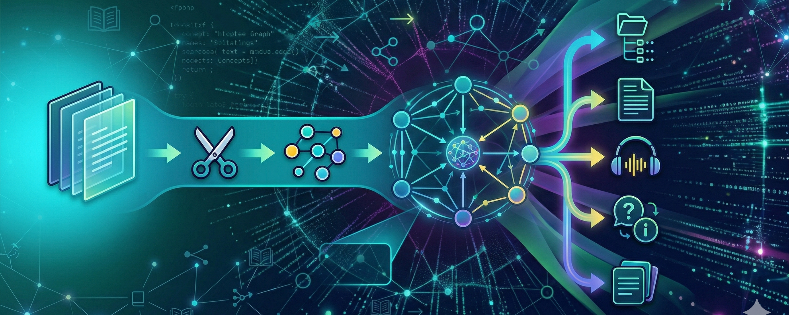
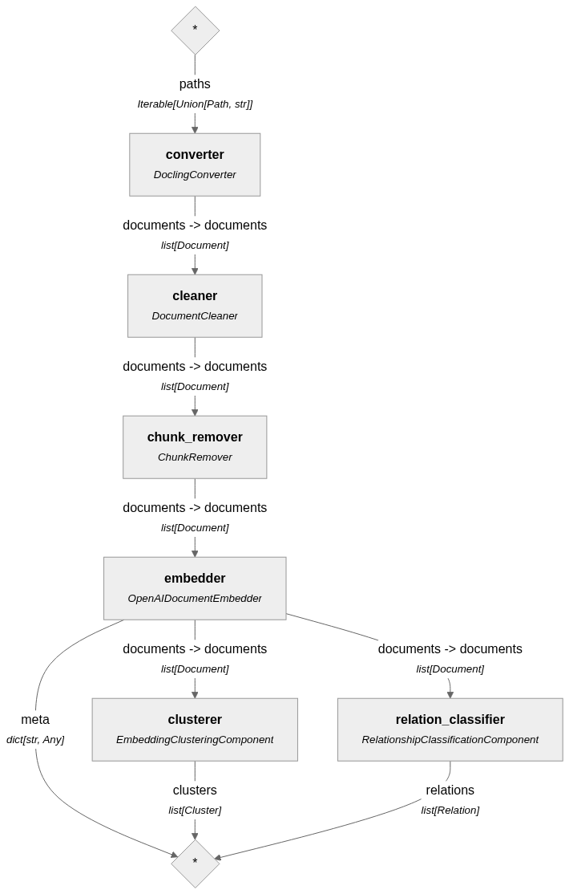

# Topic Shift 🧠📄




**Topic Shift** is a modern, full-stack application designed to automatically extract topics, conceptual contents, and relationships from lecture slides and PDF documents. It transforms unstructured educational materials into interactive, easily digestible knowledge graphs.

This tool was built to help students, researchers, and educators visualize complex topics, identify key themes, and understand the underlying connections between different concepts presented in slide decks.

## ✨ Features
 

- **Advanced PDF Parsing**: Leverages IBM's `docling` to intelligently parse PDF layouts, including tables and structured text, optimized specifically for presentation slides.
- **AI-Powered NLP Pipeline**: Utilizes `haystack-ai` and OpenAI embeddings to process, clean, and semantically embed document segments.
- **Concept Clustering**: Automatically groups related concepts and slides together using semantic embeddings.
- **Relationship Extraction**: Classifies and extracts logical relationships between the document chunks.
- **Interactive Knowledge Graphs**: Visualizes the extracted topics and their relationships using a highly interactive, node-based graph powered by `Vue Flow`.
- **Asynchronous Processing**: Implements non-blocking background task execution using FastAPI, ensuring a seamless user experience even when processing large, multi-page PDFs.
- **Local Storage**: Employs lightweight local data persistence using `TinyDB` for managing task states, clusters, and graph relations.

## 🛠️ Tech Stack

**Backend (Python 3.11+)**
- **Framework**: [FastAPI](https://fastapi.tiangolo.com/)
- **AI & NLP**: [Haystack AI](https://haystack.deepset.ai/), [Docling](https://github.com/DS4SD/docling), OpenAI API
- **Database**: [TinyDB](https://tinydb.readthedocs.io/)
- **Package Management**: [uv](https://docs.astral.sh/uv/)

**Frontend (TypeScript)**
- **Framework**: [Vue 3](https://vuejs.org/) (Composition API)
- **Build Tool**: [Vite](https://vitejs.dev/)
- **Graph Visualization**: [Vue Flow](https://vueflow.dev/)
- **Styling**: [TailwindCSS](https://tailwindcss.com/) & [reka-ui](https://github.com/wobsoriano/reka-ui)

## 🚀 Getting Started

### Prerequisites

- **Python** `>= 3.11, < 3.13`
- **Node.js** `>= 18.x`
- **UV** (Python package manager)
- **OpenAI API Key** (Required for document embeddings and relationship classification)

### Backend Setup

1. Clone the repository and navigate to the project root:
   ```bash
   cd topic_shift
   ```

2. Install the backend dependencies using uv:
   ```bash
   uv sync
   ```

3. Set up your environment variables. You will need an OpenAI API key for the embedding pipeline:
   ```bash
   export OPENAI_API_KEY="your-openai-api-key"
   ```

4. Start the FastAPI development server:
   ```bash
   uv run uvicorn src.api:app --reload
   ```
   *The API will be available at `http://localhost:8000`. You can view the Swagger UI documentation at `http://localhost:8000/docs`.*

### 🐳 Docker Setup

The easiest way to run the entire stack is using Docker and Docker Compose.

1. Ensure you have an `.env` file in the root directory with your `OPENAI_API_KEY`.
2. Run the following command:
   ```bash
   docker-compose up --build
   ```
3. The frontend will be available at `http://localhost:3000` and the backend at `http://localhost:8000`.

## 🏗️ Architecture & AI Pipeline



Topic Shift processes documents through a highly optimized data pipeline orchestrated by Haystack:

1. **Ingestion & Conversion**: The uploaded PDF is processed by the `DoclingConverter`, which accurately extracts text while respecting document layout.
2. **Cleaning**: A `DocumentCleaner` removes unwanted artifacts, extra whitespaces, and specific user-defined substrings.
3. **Embedding**: Cleaned document segments are embedded using `OpenAIDocumentEmbedder` to capture their semantic meaning in vector space.
4. **Clustering**: The custom `EmbeddingClusteringComponent` groups conceptually similar document segments into coherent topics.
5. **Relationship Classification**: The `RelationshipClassificationComponent` analyzes the clusters to determine how different topics correlate and connect to each other.
6. **Graph Generation**: The resulting relationships and clusters are mapped into a directional graph structure, persisted in TinyDB, and served to the Vue frontend for interactive visualization.

## 👤 Author

**Linus Bierhoff** 
- Email: mail@linusbierhoff.com
